# 🌟 My QR 🌟

Aplikasi untuk membuat kode QR yang indah dan memindai berbagai jenis kode QR.

<div style="display:flex; flex-direction:row; flex-wrap:wrap; justify-content:center; gap:8px;">
    <a href="#"></a>
    <a href="https://www.padlet.com"></a>
    <a href="https://www.uilicious.com"></a>
    <a href="https://www.supabase.com"></a>
    <a href="https://www.vercel.com"></a>
    <a href="https://viteconf.org/"></a>
</div>

## ✨ Fitur ✨

- ✅ Aksesibilitas: minimal mematuhi WCAG A
- 🎨 Warna dan gaya yang dapat disesuaikan
- 🖼️ Ekspor ke SVG dan PNG
- 📋 Salin ke clipboard
- 🌓 Mode terang/gelap/sistem
- 🎲 Tombol acak gaya
- 🌐 Tersedia dalam lebih dari 10 bahasa
- 💾 Simpan & Muat konfigurasi Kode QR
- 🖼️ Unggah gambar khusus untuk logo
- 🎭 Theme: Gaya Kode QR yang telah dirancang sebelumnya
- 🛡️ Tingkat koreksi kesalahan: mempengaruhi ukuran kode QR dan logo di dalamnya. Gunakan tingkat koreksi yang lebih rendah untuk data yang lebih besar agar dapat dibaca.
- 📱 Pemindai Kode QR: Pindai kode QR menggunakan kamera atau dengan mengunggah gambar, dengan deteksi cerdas untuk URL, email, nomor telepon, kredensial WiFi, dan lainnya
- 📦 Ekspor data massal: Impor file CSV dengan beberapa string data dan ekspor kode QR untuk semuanya sekaligus.
- 📲 Dukungan PWA: Instal MyQR sebagai aplikasi desktop atau seluler

## 🚀 Instalasi 🚀

### Menggunakan Docker
1. **Unduh file `docker-compose.yml`**:
    ```bash
    wget https://github.com/JonathanZefanya/my-qr/raw/main/docker-compose.yml
    ```

2. **Jalankan Docker Compose**:
    ```bash
    docker compose up -d
    ```

### Sebagai PWA (Progressive Web App)
Kamu dapat menginstal aplikasi ini sebagai PWA di perangkat Anda:

1. **Desktop (Chrome/Edge)**:
   - Kunjungi [my-qr.vercel.app](https://my-qr-delta.vercel.app/)
   - Klik ikon instalasi (➕) di bilah alamat
   - Klik "Install" pada prompt yang muncul

2. **Mobile (Android)**:
   - Kunjungi [my-qr.vercel.app](https://my-qr-delta.vercel.app/)
   - Ketuk opsi "Add to Home Screen" di menu browser Anda
   - Ketuk "Install" atau "Add"

3. **iOS (Safari)**:
   - Kunjungi [my-qr.vercel.app](https://my-qr-delta.vercel.app/)
   - Ketuk tombol Share
   - Gulir ke bawah dan ketuk "Add to Home Screen"
   - Ketuk "Add"

Setelah diinstal, MyQR akan bekerja secara offline dan menyediakan pengalaman seperti aplikasi native.

### Menjalankan Secara Lokal Tanpa Docker
1. **Klon repositori**:
    ```bash
    git clone https://github.com/JonathanZefanya/my-qr.git
    cd my-qr
    ```

2. **Instal dependensi**:
    ```bash
    npm install
    ```

3. **Jalankan aplikasi**:
    ```bash
    npm run dev
    ```

Aplikasi akan berjalan di `localhost` pada port yang ditentukan (biasanya `localhost:3000` atau `localhost:8080`).

## 📸 Demo 📸

Coba sekarang [di sini](https://my-qr-delta.vercel.app/) ✨

## 🐋 Self-hosting dengan Docker 🐋

My-QR dapat dengan mudah di-hosting sendiri. Kami menyediakan file [docker-compose.yml](docker-compose.yml) serta gambar kami sendiri. Kami menggunakan GitHub's `ghrc.io` Container Registry.

```bash
wget https://github.com/JonathanZefanya/my-qr/raw/main/docker-compose.yml

docker compose up -d
```